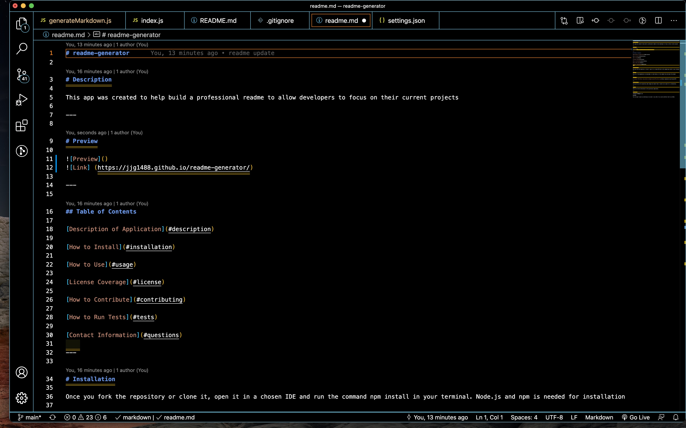

## readme

# Description

This application helps develpers to focus on their current tests by taking their focus off of creating a readme

---

# Preview

![Link] (https://jjg1488.github.io/readme-generator/)

![Live] (https://drive.google.com/file/d/1qNey7zrj9KnRSB8tzsWv1RDQz-ek-uM5/view)

---

## Table of Contents

[Description of Application](#description)

[How to Install](#installation)

[How to Use](#usage)

[License Coverage](#license)

[How to Contribute](#contributing)

[How to Run Tests](#tests)

[Contact Information](#questions)
    
---

# Installation

Once you fork the repository or clone it, open it in a chosen IDE and run the command npm install in your terminal

---

 # Usage

Once all of the dependencies are downloaded, run node index.js in the command line and answer the prompts

---

# License

---

# Contributing

You may fork over the repository, make changes and submit them, or contact me via email for a collaboration

---

# Tests

undefined

---

# Questions

jamesgault1488@gmail.com

@JJG1488

You can report issues by contacting me via email or any of my social platforms linked to my GitHub

